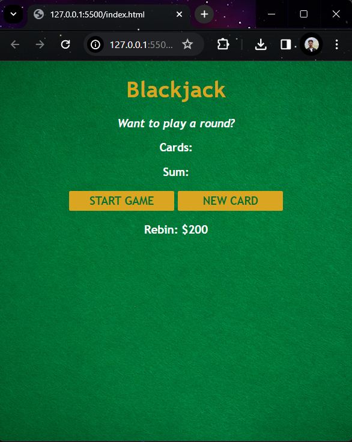
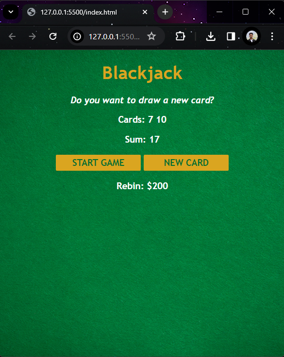
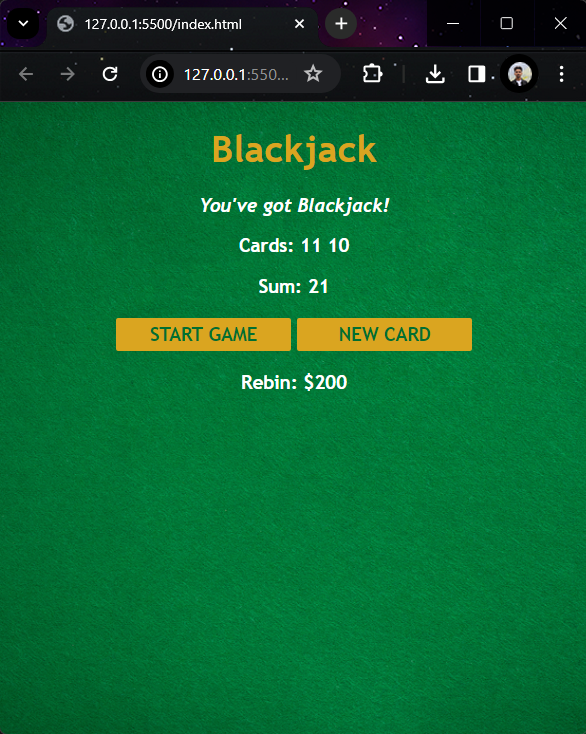
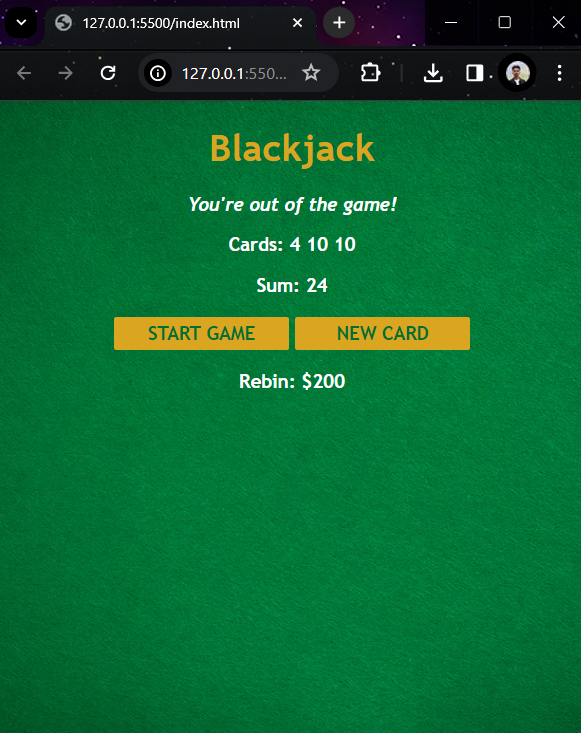

# Blackjack App

This is a simple blackjack web application built using HTML, CSS, and JavaScript.

## Overview

This application allows users to play a blackjack game. The user can start the game by clicking the "START GAME" button. Two cards will be dealt to the player, and the sum of these cards will be displayed. The player can then draw additional cards by clicking the "NEW CARD" button. The goal is to get as close to 21 without going over.

## How to Play

1. Click the "START GAME" button to begin the game.
2. Two cards will be dealt to you, and their sum will be displayed.
3. Click the "NEW CARD" button to draw an additional card.
4. Keep drawing cards until you either reach 21 (blackjack) or decide to stop.
5. If the sum of your cards exceeds 21, you lose the game.

## Features

- Simple and intuitive user interface.
- Basic gameplay mechanics for blackjack.

## Live Demo

You can try the live demo [here](https://black-jackapp.netlify.app/).

## Installation

1. Clone this repository to your local machine:

```bash
git clone https://github.com/rebin03/BlackJack-app.git
```
2. Open the index.html file in your web browser.

## Screenshots

Screenshot 1: Initial state of the game



Screenshot 2: Starting the game



Screenshot 3: Getting blackjack at starting



Screenshot 4: Drawing a new card


